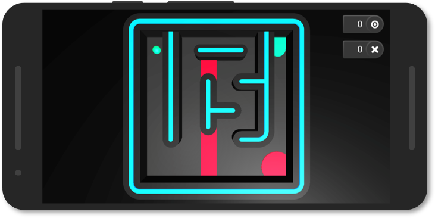

# Marble Maze

> A marble maze game for mobile platforms.

"Marble Maze" is a small game for mobile platforms that support accelerometer input. The project is developed with Unity. It was originally created for use in lectures at the university to teach the principles of accelerometers.

     
     
    
     
     

## Play

Orient your smartphone horizontally so that your screen is facing upwards towards the sky. Tilt your smartphone to navigate the ball through the maze. The goal of the game is to reach the green target while avoiding the red areas.

## Third Party Content

Many assets of this project were created by other people. Check out the [Third Party Content](/ThirdPartyContent.md) file for details.

## License

This project is licensed under a MIT license. See the [LICENSE](/LICENSE) file for details.

## Support

This project was created by [Daniel Dyrda](https://dyrda.io). If you want to support me and my projects, you can follow me on [github (dyrdaio)](https://github.com/dyrdaio) and [twitter (@dyrdaio)](https://twitter.com/dyrdaio). Just come by and say hello, I would love to hear how you use the project.

## Contribute

This project was developed by [Daniel Dyrda](https://dyrda.io) and is based on a teaching project created in the FAR group of TUM. If you want to contribute to this project, you are welcome to do so. Just write me and we will find a way to collaborate.
